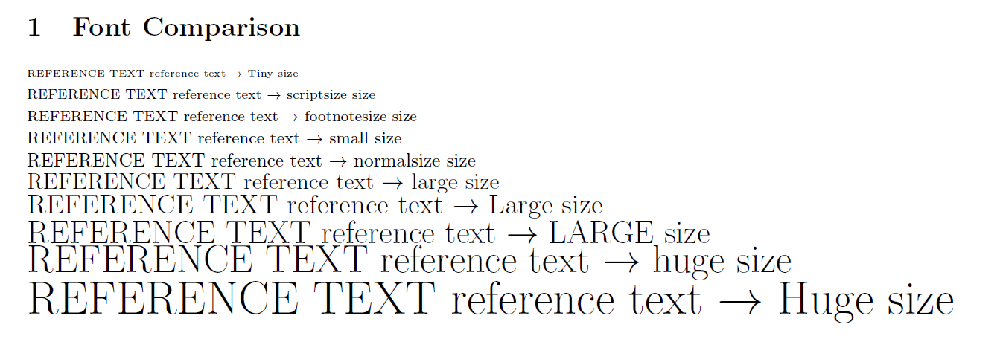

# Fontsizes -- Larger and Smaller


Sometimes you might find a need to shrink items to make sure they fit in the page. This has especially applied to making `tables` because rows are too long.

For the official Overleaf documentation, click [here](https://www.overleaf.com/learn/latex/Font_sizes%2C_families%2C_and_styles).

```latex
\begin{INSERT}
    ...
\end{INSERT}
```

Replace ***INSERT*** with one of the following:
- `tiny`
- `scriptsize`
- `footnotesize`
- `small`
- `normalsize`
- `large`
- `Large`
- `LARGE`
- `huge`
- `Huge`

> ❗️ We recommend only using `footnotesize` or larger. 
> Readability can be difficult at smaller levels, especially with equations and tables. 
> 
> Unless needed or for emphasis, you should stick to the default size however.


#### Example
```latex
This text WON'T be affected

\begin{footnotesize}
    This text WILL be affected
    $This equation WILL be affected$
    This text WILL be affected
\end{footnotesize}

This text WON'T be affected
```

## Directly using `\fontsize`
Alteratively, you can also use the command itself directly. 

```latex
\tiny
\scriptsize
\footnotesize
\small
\normalsize
\large
\Large
\LARGE
\huge
\Huge
```

Note that this will propogate and continue until it hits the end of a `{}` bracket pair. When you use these, you should surround the area you want affected with `{}` brackets.

#### Example
```latex
this text WON'T be affect

{\tiny this text WILL be affected} this text WON'T be affect

this text WON'T be affect
```

## Reference Images and Notes


The following code was used to compile the following PDF and images for reference. Click on any of the images to see the actual PDF.
```Latex
\section{Font Comparison}

{\tiny REFERENCE TEXT reference text $\rightarrow$ Tiny size}\\
{\scriptsize REFERENCE TEXT reference text $\rightarrow$ scriptsize size}\\
{\footnotesize REFERENCE TEXT reference text $\rightarrow$ footnotesize size}\\
{\small REFERENCE TEXT reference text $\rightarrow$ small size}\\
{\normalsize REFERENCE TEXT reference text $\rightarrow$ normalsize size}\\
{\large REFERENCE TEXT reference text $\rightarrow$ large size}\\
{\Large REFERENCE TEXT reference text $\rightarrow$ Large size}\\
{\LARGE REFERENCE TEXT reference text $\rightarrow$ LARGE size}\\
{\huge REFERENCE TEXT reference text $\rightarrow$ huge size}\\
{\Huge REFERENCE TEXT reference text $\rightarrow$ Huge size}\\
```
*Zoomed in* 
[](../reference%20files/Font%20Sizes%20Sample.pdf)

*Letter/A4 paper reference*
[](../reference%20files/Font%20Sizes%20Sample.pdf)

[Link to the PDF to view](../reference%20files/Font%20Sizes%20Sample.pdf)


## Related Stuff
This is similar to how you would change font colour or font style. See [here](font%20colour.md) for font colour notes.